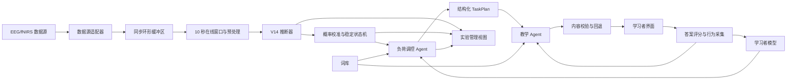

# NeuroLoad-LexiAgent 完整系统设计

## 1. 文档信息

- 项目名称：NeuroLoad-LexiAgent
- 中文名称：基于 EEG-fNIRS 实时认知负荷调控的智能英语词汇学习系统
- 文档类型：硕士毕业设计系统规格与论文方法设计依据
- 版本：1.0
- 日期：2026-09-06
- 基础算法：NeuroLoad-Fusion V14
- 基础权重：`reliable_subjectgap_seed42_v14_hbadapter_hblogit002.pth`
- 当前实现状态：V14 离线训练和评估代码已经存在；在线推断服务、状态控制、学习者模型、Agent、应用界面和闭环实验属于本设计新增内容。

本文档整合以下五部分设计：

1. EEG-fNIRS 多模态认知负荷识别模型；
2. 离线分类器到在线负荷推断服务的扩展；
3. 认知负荷概率平滑与稳定状态控制；
4. 个性化学习者模型与词汇任务决策；
5. 受约束教学 Agent、学习应用与分层实验方案。

文档中的“现有实现”描述当前代码与权重已经具备的能力；“系统设计”描述后续应实现的能力；“初始参数”是工程起点，正式论文必须通过验证集、离线回放或预实验确定最终数值。

## 2. 研究问题与项目定位

### 2.1 核心问题

普通词汇学习系统通常依据固定词表、答题正确率或间隔重复算法安排学习任务，无法感知学习者当前的认知资源状态。相同任务在不同时间、不同个体上可能造成完全不同的认知负荷：负荷过低可能降低学习投入，负荷过高则可能造成错误增加、疲劳和无效记忆。

本项目研究以下核心问题：

> 能否利用 EEG 与 fNIRS 多模态生理信号实时估计低、中、高认知负荷，并通过可解释的闭环 Agent 稳定调整英语词汇任务，使学习过程尽量维持在适中的认知负荷区间？

### 2.2 主要研究目标

1. 建立受试者独立的 EEG-fNIRS 三分类认知负荷模型。
2. 将离线窗口分类器封装为可持续处理数据流的在线推断服务。
3. 通过概率校准、时间平滑、滞回和异常降级得到稳定负荷状态。
4. 建立同时考虑词汇客观难度与用户主观熟悉度的学习者模型。
5. 构建受确定性策略约束的 Agent，根据负荷状态选择新词、旧词和活动类型。
6. 使用大语言模型生成受控的释义、例句、记忆提示和反馈。
7. 从模型性能、系统实时性、调节稳定性和用户闭环效果四个层次完成验证。

### 2.3 主要贡献定位

本项目的工作量不应被表述为单纯的“模型精度提升”，而应形成三个层次的贡献：

- 算法层：具有 HbO/HbR 建模和时延感知跨模态融合的 EEG-fNIRS 认知负荷模型。
- 系统层：从同步生理数据流到稳定认知负荷事件的在线推断架构。
- 应用层：以认知负荷为反馈信号的闭环英语词汇学习 Agent。

### 2.4 非目标

- 系统不用于医疗诊断，也不输出疾病、心理健康或神经系统结论。
- 第一版不追求多用户云端高并发，不引入 Kafka 等重型基础设施。
- 大语言模型不负责解释脑信号，不直接决定认知负荷类别。
- 大语言模型不拥有绕过调控策略、任意升级学习难度的权限。
- 论文不在缺少实验依据时宣称系统已经提高长期词汇保持率。

## 3. 总体闭环架构

系统采用“感知、估计、决策、生成、交互、记忆更新”的闭环：



架构责任边界如下：

| 模块 | 输入 | 输出 | 不负责的内容 |
|---|---|---|---|
| 数据源适配器 | 设备数据或回放数据 | 带时间戳的统一数据块 | 负荷分类 |
| 窗口构造器 | EEG/fNIRS 数据块 | 对齐的模型输入窗 | 学习任务决策 |
| V14 推断器 | `(1,30,2000)`、`(1,36,100)` | logits 与概率 | 时间稳定判断 |
| 状态估计器 | 连续概率和信号质量 | 稳定负荷状态 | 单词选择 |
| 调控 Agent | 稳定负荷和学习者状态 | `TaskPlan` | 自由生成事实 |
| 教学 Agent | `TaskPlan` 和词典事实 | 教学内容与反馈 | 改变难度策略 |
| 学习者模型 | 作答和复习行为 | 个体词汇状态 | 脑信号推断 |

## 4. 现有数据与预处理基础

### 4.1 数据集命名

当前代码目录、默认路径和预处理文件均使用 `Shin2018` 名称。论文此前可能使用了“Shin2019”的称呼，正式写作前必须依据原始数据集论文、下载来源和版本说明统一名称。论文的数据集名称、引用年份、受试者数量、任务范式和类别定义不得仅依据本地目录名推断。

### 4.2 样本格式

现有 V14 每个 `.pkl` 样本包含：

```python
{
    "X_eeg": np.ndarray,   # float32, (30, 2000)
    "X_nirs": np.ndarray,  # float32, (36, 100)
    "y": int               # 0、1、2
}
```

预处理脚本将 EEG 重采样到 200 Hz，将 fNIRS 重采样到 10 Hz，并截取 10 秒窗口。因此：

- EEG：`200 Hz * 10 s = 2000` 个采样点；
- fNIRS：`10 Hz * 10 s = 100` 个采样点；
- EEG 与 fNIRS 使用同一事件起点截取对应时间范围；
- fNIRS 默认 `block` 布局，前 18 个通道为 HbO，后 18 个通道为 HbR。

### 4.3 重叠增强样本

`processed_aug_stride2` 的预处理代码为每个事件生成 5 个窗口，后缀为 `aug0` 至 `aug4`。代码实际使用：

```text
offset_sec = step * (STRIDE_SEC / 2.0)
STRIDE_SEC = 2.0
```

因此窗口起点实际偏移为 0、1、2、3、4 秒，而不是文件夹名称容易让人理解的固定 2 秒间隔。该事实需要在数据章节中如实说明。

这些窗口高度重叠。数据划分必须以受试者为最小隔离单位，至少也必须保证同一原始事件的所有增强窗口进入同一分区。严禁将同一事件的不同 `aug` 窗口随机分到训练集和测试集。

### 4.4 标准化与训练增强

Dataset 对 EEG 和 fNIRS 分别执行逐通道 z-score：

\[
\hat{x}_{c,t}=\frac{x_{c,t}-\mu_c}{\sigma_c+10^{-5}}
\]

训练阶段可额外执行：

- 时间轴随机平移；
- 高斯噪声；
- 连续时间段遮挡；
- EEG 与 fNIRS 使用相同样本置换和 MixUp 系数的多模态 MixUp。

在线推断只能保留与训练一致的确定性预处理，例如通道排列、重采样和 z-score。随机平移、噪声、遮挡和 MixUp 均不得在推断阶段启用。

## 5. NeuroLoad-Fusion V14 模型详细结构

### 5.1 模型配置与规模

当前指定权重使用的关键运行配置为：

| 参数 | 值 |
|---|---:|
| EEG 通道数 | 30 |
| EEG 输入长度 | 2000 |
| fNIRS 通道数 | 36 |
| fNIRS 输入长度 | 100 |
| 类别数 | 3 |
| EEG 嵌入维度 | 256 |
| EEG Transformer 头数 | 8 |
| EEG Transformer 深度 | 4 |
| STFT `n_fft` | 200 |
| STFT `hop_length` | 100 |
| fNIRS 特征维度 | 128 |
| 交叉注意力头数 | 4 |
| fNIRS 布局 | `block` |
| Hb 模式 | `mixed_split_residual` |
| Hb 分支模式 | `adapter` |
| 对齐模式 | `local` |
| 融合模式 | `logit` |
| PreBlock 模式 | `legacy` |

按当前代码实例化后，模型包含 5,504,958 个参数，其中 5,504,928 个为浮点参数，权重文件包含 299 个状态张量。指定权重已使用上述配置完成严格 `state_dict` 加载验证。

### 5.2 EEG 分支：BIOT 频谱 token 编码

EEG 输入记为：

\[
X^E\in\mathbb{R}^{B\times30\times2000}
\]

对每个 EEG 通道独立执行短时傅里叶变换。代码设置 `center=False`、单边频谱和幅值输出，因此频率维度为：

\[
F=\frac{200}{2}+1=101
\]

时间帧数量为：

\[
T_E=\left\lfloor\frac{2000-200}{100}\right\rfloor+1=19
\]

每个通道得到 `101 x 19` 的频谱幅值。频率向量通过线性层从 101 维投影到 256 维：

\[
Z^E_{c,t}=W_p|\operatorname{STFT}(X^E_c)_t|+b_p
\]

随后加入两类编码：

- 通道嵌入：区分 30 个 EEG 电极；
- 正弦位置编码：描述同一通道内 19 个频谱帧的位置。

30 个通道按通道顺序拼接，形成：

\[
Z^E_0\in\mathbb{R}^{B\times(30\cdot19)\times256}
=\mathbb{R}^{B\times570\times256}
\]

序列进入 4 层、8 头线性注意力 Transformer，得到 EEG token：

\[
Z^E=\operatorname{BIOT}(Z^E_0)
\in\mathbb{R}^{B\times570\times256}
\]

对 token 维平均池化得到全局 EEG 特征，并经过残差适配器：

\[
f_E=\operatorname{MeanPool}(Z^E)
\]

\[
\tilde f_E=f_E+\operatorname{LN}(W_2\operatorname{GELU}(W_1f_E))
\in\mathbb{R}^{B\times256}
\]

该适配器允许多模态训练在保留 BIOT 表征的基础上调整 EEG 特征空间。

### 5.3 fNIRS 染色团重构

fNIRS 输入记为：

\[
X^N\in\mathbb{R}^{B\times36\times100}
\]

在 `block` 布局下，输入被重构为：

\[
X^{HB}=\operatorname{Stack}(X^N_{1:18},X^N_{19:36})
\in\mathbb{R}^{B\times2\times18\times100}
\]

其中第二维分别表示 HbO 和 HbR。部署时通道名称与排列必须通过模型清单固定，不能仅依赖设备输出顺序。

### 5.4 AdaptiveFNIRSPreBlock

PreBlock 使用窗口大小为 3、7、15、31 的时间平均池化估计多尺度低频趋势：

\[
T_k=\operatorname{AvgPool}_k(X^{HB}),\quad k\in\{3,7,15,31\}
\]

`legacy` 模式将原信号、多尺度趋势以及两个差分项拼接为 14 个特征通道：

\[
U=\operatorname{Concat}(X^{HB},T_3,T_7,T_{15},T_{31},X^{HB}-T_7,X^{HB}-T_{31})
\]

两个 1x1 卷积从这些特征估计趋势项与门控项：

\[
(R,G)=\operatorname{FilterNet}(U)
\]

滤波结果为：

\[
X_F=X^{HB}-\sigma(G)\odot R
\]

归一化后保留原始信号残差：

\[
\tilde X^{HB}=\operatorname{LayerNorm}(X_F)+\gamma X^{HB}
\]

其中 \(\gamma\) 为可学习残差尺度。该结构试图抑制样本相关的慢趋势，同时避免完全删除可能与任务相关的缓慢血氧变化。

### 5.5 混合 fNIRS 主流编码器

预处理后的 HbO/HbR 按原布局展平为 36 通道，进入 `ComplexNIRS_Encoder`。编码器包含：

1. 核大小 3 和 7 的双分支一维卷积，各输出 32 通道；
2. 拼接为 64 通道并进行 BatchNorm 与 ReLU；
3. `64 -> 128` 卷积和 2 倍最大池化，时间长度 `100 -> 50`；
4. `128 -> 256` 卷积和 2 倍最大池化，时间长度 `50 -> 25`；
5. 256 通道的 Squeeze-and-Excitation 注意力；
6. `256 -> 128` 的线性投影、LayerNorm、ReLU 和 Dropout。

同一个卷积主干同时输出：

\[
f_N\in\mathbb{R}^{B\times128}
\]

以及保留时间结构的：

\[
Z^N\in\mathbb{R}^{B\times25\times128}
\]

全局特征用于主分类器，25 个 token 用于跨模态注意力。

### 5.6 HbO/HbR 残差支路

`mixed_split_residual` 模式除混合 36 通道主流外，还分别取：

\[
X^{O}\in\mathbb{R}^{B\times18\times100},\qquad
X^{R}\in\mathbb{R}^{B\times18\times100}
\]

HbO 和 HbR 共享一个 18 通道 `ComplexNIRS_Encoder`，以减少完全独立编码造成的参数膨胀。`adapter` 模式再使用两个不同的残差适配器，使共享特征具备染色团特异性：

\[
Z^O_A=\operatorname{FeatureAdapter}_O(Z^O)
=Z^O+\operatorname{LN}(W^O_2\operatorname{GELU}(W^O_1Z^O))
\]

\[
Z^R_A=\operatorname{FeatureAdapter}_R(Z^R)
=Z^R+\operatorname{LN}(W^R_2\operatorname{GELU}(W^R_1Z^R))
\]

当前模型类始终创建共享编码器、独立 HbO 编码器和独立 HbR 编码器，以保持不同模式和旧权重的状态结构；在 `adapter` 前向路径中，实际使用共享编码器与两个适配器。论文统计“实际计算路径”时应与“模型中注册的总参数”区别说明。

### 5.7 时延感知 fNIRS-to-EEG 交叉注意力

交叉注意力使用 fNIRS token 作为 Query，EEG token 作为 Key 和 Value：

\[
Q=W_Q\operatorname{LN}(Z^N),\quad
K=V=\operatorname{LN}(Z^E)
\]

选择这个方向的含义是：由血氧时间特征查询与其相关的 EEG 频谱上下文，而不是将两个模态简单拼接。

在 `local` 模式下，对第 \(i\) 个 fNIRS token，先按 token 相对位置映射到 EEG 的 19 个 STFT 帧，再向前偏移 `delay_frames=2`，仅允许访问最近 `window_frames=8` 个 EEG 帧。掩码对 30 个 EEG 通道共享时间范围。

掩码后的多头注意力为：

\[
C=\operatorname{MHA}(Q,K,V;M_{delay})
\]

上下文从 256 维投影回 128 维，并由 fNIRS token 和上下文共同产生门控：

\[
G_C=\sigma(W_G[Z^N;C])
\]

\[
\tilde C=G_C\odot\operatorname{Proj}(C)
\]

随后通过可学习 token 权重池化并乘以可学习尺度 \(\alpha\)：

\[
a_i=\operatorname{softmax}(w_p^TZ^N_i)
\]

\[
c_N=\alpha\sum_i a_i\tilde C_i
\in\mathbb{R}^{B\times128}
\]

混合流、HbO 流和 HbR 流各有独立的交叉注意力模块。需要强调：该局部掩码是基于 token 位置和经验帧数的模型约束，不等同于已经完成以秒为单位的生理血流响应时延建模。其生理解释和参数敏感性必须通过消融实验谨慎讨论。

### 5.8 HbO/HbR 跨模态残差融合

HbO 和 HbR 分别得到跨模态上下文 \(c_O\) 和 \(c_R\)，再由门控融合：

\[
g_{OR}=\sigma(W_{OR}[c_O;c_R])
\]

\[
c_{split}=g_{OR}\odot c_O+(1-g_{OR})\odot c_R
\]

混合 fNIRS 主流上下文与染色团上下文进行残差组合：

\[
c=c_N+\lambda_{split}c_{split}
\]

其中 \(\lambda_{split}\) 为可学习标量。

### 5.9 特征级门控与 logit 级融合

首先拼接全局 EEG 和 fNIRS 特征：

\[
h_0=[\tilde f_E;f_N]\in\mathbb{R}^{B\times384}
\]

特征级门控为：

\[
g_F=\sigma(W_Fh_0),\qquad h=g_F\odot h_0
\]

主分类器输出：

\[
z_{main}=W_2\operatorname{Dropout}(\operatorname{SiLU}(W_1h))
\in\mathbb{R}^{B\times3}
\]

`logit` 模式不直接把 \(c\) 拼接到主特征，而是生成辅助类别证据：

\[
z_C=\operatorname{CrossHead}(c)
\]

\[
g_C=\sigma(W_C[\tilde f_E;f_N;c])
\]

\[
z'=z_{main}+\lambda_C g_C\odot z_C
\]

HbO 与 HbR 还分别产生 logits，并由类别级门控融合：

\[
z_{HB}=g_{HB}\odot z_O+(1-g_{HB})\odot z_R
\]

最终输出为：

\[
z=z'+\lambda_{HB}z_{HB}
\]

所以完整 V14 不是单一“拼接融合”，而是以下三级融合：

1. EEG 与 fNIRS 全局特征的门控融合；
2. fNIRS 查询延迟 EEG token 的跨模态上下文融合；
3. 主分类 logits、混合跨模态 logits 和 HbO/HbR logits 的残差融合。

### 5.10 当前权重中的可学习尺度

指定权重严格加载后，各标量为：

| 标量 | 权重值 |
|---|---:|
| 混合流交叉注意力 `alpha` | 0.0012104751 |
| HbO 交叉注意力 `alpha` | 0.0068072253 |
| HbR 交叉注意力 `alpha` | 0.0045191902 |
| `aux_logit_scale` | 0.0431814641 |
| `hb_split_scale` | 0.0043877452 |
| `hb_logit_scale` | 0.0029373281 |

这些数值只能用于描述训练结果中的参数状态。尺度较小不能单独证明某支路“无作用”，因为支路输出幅值、门控和下游分类头共同决定实际贡献，必须使用消融实验或输出贡献统计进行解释。

### 5.11 训练策略

主训练流程使用 AdamW 和参数组学习率：

| 参数组 | 默认学习率 |
|---|---:|
| EEG 编码器 | `1e-5` |
| EEG 适配器 | `5e-5` |
| fNIRS PreBlock | `3e-4` |
| fNIRS 编码器 | `1e-4` |
| 融合模块与分类头 | `3e-4` |

默认权重衰减为 `0.01`，训练 50 个 epoch。训练分两阶段：

- 阶段一：前 15 个 epoch 冻结 EEG 编码器和 EEG 适配器，训练 fNIRS 与融合头；
- 阶段二：解冻 EEG 分支进行联合微调。

第二阶段默认 MixUp `alpha=0.1`，阶段一默认不使用 MixUp。学习率调度器根据评价指标在平台期将学习率乘以 0.5。

### 5.12 现有实现中正式实验前必须解决的问题

1. 主训练脚本每个 epoch 使用测试集准确率调度学习率并保存最佳模型，不能作为论文最终无偏评估流程。
2. 受试者划分脚本虽然有独立验证集，但 `build_model` 未传入 `mixed_split_residual`、`adapter` 等完整 V14 参数。由于不同模式可能共享相同参数形状，权重可能严格加载成功但执行不同前向路径。
3. `nirs_dim_model`、`nirs_depth` 和 `nirs_dropout` 等参数传入 V14 构造函数，但当前使用的 `ComplexNIRS_Encoder` 并未消费这些参数。论文不能将它们描述为已生效超参数。
4. 在线部署必须使用严格权重加载；训练迁移所用的部分加载函数不能用于生产推断。
5. BatchNorm 和 Dropout 要求推断前调用 `model.eval()`。
6. 数据集增强窗口高度重叠，必须按受试者隔离并审计事件级数据泄漏。

## 6. 在线负荷推断服务

### 6.1 技术定位

在线服务采用本地常驻 Python API。推荐技术栈为 PyTorch、FastAPI、Pydantic、WebSocket 和 SQLite。模型推断、Agent 后端和前端可以部署在同一台实验计算机上，但仍通过明确接口解耦。

第一版不要求直接支持具体设备 SDK。设备接入层遵循统一数据源协议，先实现窗口回放和原始连续记录回放，之后替换为真实设备适配器。

### 6.2 模型清单 Model Manifest

权重旁必须保存不可缺失的模型清单，至少包含：

```json
{
  "model_name": "NeuroLoad-Fusion-V14",
  "checkpoint_sha256": "2e17176dbe815febad87eb51f8a919715aa9af9c7c26a6b0294998e24813e3d6",
  "class_mapping": {"0": "low", "1": "medium", "2": "high"},
  "eeg_channels": 30,
  "eeg_sample_rate_hz": 200,
  "eeg_window_samples": 2000,
  "fnirs_channels": 36,
  "fnirs_sample_rate_hz": 10,
  "fnirs_window_samples": 100,
  "fnirs_layout": "block",
  "normalization": "per-channel-window-zscore",
  "nirs_hb_mode": "mixed_split_residual",
  "nirs_hb_branch_mode": "adapter",
  "cross_alignment_mode": "local",
  "cross_fusion_mode": "logit"
}
```

实际文件还必须保存 EEG、HbO、HbR 的通道名称和顺序。清单与运行参数不一致时，服务拒绝启动。

上述类别映射延续当前三分类使用约定。正式部署前必须对照原始数据标记确认 `0/1/2` 与低、中、高负荷的语义关系，并将确认后的映射固化在清单中；代码中的整数顺序本身不能替代数据集语义证据。

### 6.3 统一数据块协议

所有数据源输出 `SignalChunk`：

```json
{
  "session_id": "anonymous-session-id",
  "stream_id": "eeg-device-stream",
  "modality": "eeg",
  "start_time": 1710000000.0,
  "sample_rate_hz": 200,
  "channel_names": ["..."],
  "samples": "binary-or-internal-array",
  "sequence_number": 120
}
```

约束如下：

- `start_time` 使用统一单调时钟或已同步设备时钟；
- `sequence_number` 用于发现重复块和丢块；
- 输入通道必须按名称映射到模型清单顺序；
- 大型矩阵不长期使用 JSON 传输，进程内使用数组，跨进程时使用二进制帧；
- 数据块只描述信号，不包含模型标签和学习决策。

### 6.4 数据源适配器

定义统一 `StreamSource` 接口，至少支持：

- `WindowReplaySource`：读取现有 `.pkl`，将每个样本视为一个完整 10 秒模型窗；
- `RawReplaySource`：读取原始连续 EEG/fNIRS 记录，按小数据块和时间戳回放；
- `DeviceStreamSource`：未来对接真实设备 SDK、LSL 或其他协议。

窗口回放只能验证模型封装、API、稳定器和 Agent 联动，不能验证连续缓冲与设备同步。只有原始连续回放和真实设备流可以用于端到端在线性结论。

### 6.5 双模态环形缓冲与窗口构造

每个会话维护独立 EEG 与 fNIRS 环形缓冲区。缓冲区至少覆盖：

```text
10 秒模型窗口 + 最大允许时钟偏差 + 重采样边界余量
```

窗口构造流程：

1. 校验会话、模态、通道、采样率、时间戳和序号；
2. 将数据块写入对应模态缓冲区；
3. 找到两个模态都完整覆盖的共同结束时间；
4. 截取共同结束时间之前最近 10 秒；
5. EEG 重采样到 2000 点，fNIRS 重采样到 100 点；
6. 按清单重排通道，fNIRS 组成 HbO/HbR block 布局；
7. 逐通道 z-score；
8. 增加 batch 维，输出两个 float32 张量。

初始更新周期设为 1 秒，即每个新窗口与前一窗口重叠 9 秒。这与训练增强代码中的 1 秒起点偏移一致，但最终更新周期需要通过延迟与稳定性实验确认。

### 6.6 模型推断器

推断器启动时执行：

1. 读取 Model Manifest；
2. 按清单实例化 V14；
3. 计算并校验权重哈希；
4. 严格加载全部状态张量；
5. 移动到配置设备；
6. 调用 `eval()`；
7. 使用固定全零或受控样本完成预热；
8. 执行输入形状检查和一次健康检查。

每次推断使用 `torch.inference_mode()`，输出 logits、softmax 概率、原始类别、模型版本、输入窗口范围和推断耗时。

### 6.7 在线 API

第一版 API 边界建议为：

| 接口 | 作用 |
|---|---|
| `POST /sessions` | 创建在线学习与推断会话 |
| `POST /sessions/{id}/signal-chunks` | 输入回放或设备数据块 |
| `GET /sessions/{id}/load/latest` | 查询最新原始与稳定负荷 |
| `WS /sessions/{id}/events` | 订阅负荷、质量和调节事件 |
| `POST /sessions/{id}/stop` | 正常结束会话并固化日志 |
| `GET /health` | 检查模型、数据库和服务状态 |

### 6.8 推断结果结构

```json
{
  "session_id": "anonymous-session-id",
  "window_start": 100.0,
  "window_end": 110.0,
  "raw_logits": [0.2, 1.5, -0.3],
  "raw_probabilities": [0.19, 0.70, 0.11],
  "raw_state": "medium",
  "smoothed_probabilities": [0.22, 0.64, 0.14],
  "stable_state": "medium",
  "confidence": 0.64,
  "signal_quality": "valid",
  "state_version": 8,
  "inference_ms": 43.2,
  "model_version": "v14-checkpoint-sha"
}
```

## 7. 信号质量与异常降级

### 7.1 第一版质量检查

在没有设备特异性质量指标前，至少执行以下通用检查：

- 通道数量和通道名称完整；
- 时间戳单调且数据块不重复；
- EEG 与 fNIRS 均覆盖完整 10 秒窗口；
- 双模态窗口结束时间偏差未超过配置上限；
- 输入不存在 NaN 或 Inf；
- 通道标准差不低于最小阈值；
- 极端幅值、长时间常数值和缺失样本比例未超过限制；
- 重采样后张量形状准确。

设备确定后，再增加接触质量、饱和、运动伪迹和设备状态指标。

### 7.2 异常策略

| 异常 | 服务行为 | Agent 行为 |
|---|---|---|
| 窗口不足 | 不推断，状态保持 `WARMUP` | 不开始自适应 |
| 单模态暂时缺失 | 不调用当前双模态权重 | 保持当前任务 |
| 通道错误 | 拒绝窗口并记录错误 | 进入保守策略 |
| 低置信度 | 不作为有效状态证据 | 不升级难度 |
| 长时间无有效窗口 | 状态转为 `UNRELIABLE` | 熟悉旧词或暂停 |
| 模型加载失败 | 服务健康检查失败 | 禁止开始会话 |
| 推断超时 | 丢弃过期结果 | 使用上一稳定状态，标记陈旧 |

第一版不应在没有单模态专用模型和验证结果时，擅自以 EEG-only 或 fNIRS-only 替代双模态模型。未来可以把经过独立训练和校准的单模态模型作为降级能力。

## 8. 负荷概率校准与稳定状态机

### 8.1 状态集合

状态机维护：

```text
WARMUP, LOW, MEDIUM, HIGH, UNRELIABLE
```

- `WARMUP`：尚未积累足够有效窗口；
- `LOW/MEDIUM/HIGH`：可供调控 Agent 使用的稳定状态；
- `UNRELIABLE`：信号或模型置信度不足，不代表真实认知负荷类别。

### 8.2 概率校准

神经网络 softmax 概率通常不天然等于真实置信度。使用验证集拟合温度参数 \(T\)：

\[
p_t=\operatorname{softmax}(z_t/T)
\]

温度只能在验证集拟合，不能使用最终测试集。校准前后报告 Expected Calibration Error 和负对数似然。

### 8.3 时间平滑

对校准概率执行指数移动平均：

\[
\bar p_t=\alpha p_t+(1-\alpha)\bar p_{t-1}
\]

初始 \(\alpha=0.3\)。由于相邻 10 秒窗口重叠 9 秒，连续预测高度相关，不能把“连续三次分类一致”解释为三个独立证据。

### 8.4 候选状态判定

候选状态必须同时满足：

\[
\max(\bar p_t)\ge \tau_p
\]

\[
\bar p_{(1),t}-\bar p_{(2),t}\ge \tau_m
\]

其中 \(\bar p_{(1),t}\) 和 \(\bar p_{(2),t}\) 分别为最大与第二大概率。初始参数建议：

- 概率阈值 `tau_p = 0.60`；
- 概率差阈值 `tau_m = 0.15`；
- 连续候选次数 `k = 3`；
- 状态最短停留时间 15 至 20 秒。

最终参数通过验证集、连续回放和敏感性分析确定。

### 8.5 滞回与状态切换

状态机分别维护当前状态、候选状态、候选计数、进入时间和最近有效窗口时间。只有候选条件持续满足并超过最短停留时间，才发布新的稳定状态版本。

对于持续高负荷，可设置比普通切换更高的优先级，但仍需满足置信度和持续性，避免单次尖峰中断学习。状态切换不会立即替换用户正在作答的题目，通常在任务边界生效。

### 8.6 状态事件

每次发布 `StableLoadEvent` 时包含：

- 当前稳定状态；
- 原始和平滑概率；
- 置信度；
- 信号质量；
- 状态版本；
- 状态持续时间；
- 触发原因；
- 对应信号窗口时间；
- 模型和状态机版本。

## 9. 学习者模型

### 9.1 两层难度表示

系统严格区分：

- 单词客观难度：相对稳定，与词频、CEFR、长度和语言学属性有关；
- 用户主观熟悉度：动态变化，表示特定用户对该词的掌握情况。

同一个困难词对熟练用户可能是低挑战任务；一个客观简单但从未见过的词也可能具有较高个体挑战度。

### 9.2 词汇静态属性

`Word` 至少包含：

| 字段 | 含义 |
|---|---|
| `word_id` | 稳定主键 |
| `lemma` | 词元 |
| `phonetic` | 音标 |
| `part_of_speech` | 词性 |
| `definitions` | 经词典验证的释义 |
| `cefr_level` | A1 至 C2 |
| `frequency_rank` | 语料词频排名 |
| `base_difficulty` | 归一化客观难度 |
| `topics` | 主题标签 |
| `source` | 词典或语料来源 |

标准事实从可信词库导入。LLM 生成内容与标准事实分开存储。

### 9.3 用户词汇动态状态

`UserWordState` 至少包含：

- 是否已经学习；
- 接触次数、正确次数和错误次数；
- 无提示正确次数；
- 提示使用次数；
- 最近反应时间和移动平均反应时间；
- 熟悉度 `mastery`；
- 记忆稳定性 `stability`；
- 可提取概率 `retrievability`；
- 最近学习时间和下次复习时间；
- 最近错误类型；
- 状态更新时间和算法版本。

### 9.4 冷启动

普通英语学习者首次使用时完成简短词汇水平估计：

1. 从多个难度层级抽取代表性单词；
2. 用户进行认识、不确定、不认识或简短释义判断；
3. 系统估计当前词汇水平；
4. 将明显掌握的词初始化为较高熟悉度；
5. 未测试词只继承群体先验，不直接判定为已掌握。

冷启动结果用于确定“相对用户而言的简单、中等、困难”，而不是永久限制用户群体。

### 9.5 个性化任务挑战度

对用户 \(u\)、单词 \(w\)、活动 \(a\)，定义：

\[
C(u,w,a)=\beta_1d_w+\beta_2(1-m_{u,w})+\beta_3d_a+\beta_4e_{u,w}
\]

其中：

- \(d_w\)：单词客观难度；
- \(m_{u,w}\)：用户熟悉度；
- \(d_a\)：活动难度；
- \(e_{u,w}\)：近期错误、慢反应和提示依赖构成的修正项。

活动难度由低到高可设为：

```text
看词选义 < 词义匹配 < 有提示回忆 < 例句填空 < 无提示拼写或释义回忆
```

系数通过预实验确定，并在论文中进行参数说明或敏感性分析。

### 9.6 记忆更新

每次作答得到表现质量 \(q\in[0,1]\)，综合：

- 是否正确；
- 反应时间；
- 使用提示次数；
- 首次作答还是修改后答对；
- 自评难度。

旧词调度采用成熟的间隔重复思想，维护稳定性与可提取概率。更新规则必须作为独立模块并记录版本，避免把 LLM 判断直接写入熟悉度。

高负荷状态下的错误可能部分来自瞬时负荷，因此降低负向更新幅度；但系统仍保留原始答题结果，方便后续比较不同更新策略。

## 10. 负荷调控 Agent

### 10.1 Agent 定义

本项目中的调控 Agent 具备 Agent 的基本闭环：

- 感知：读取稳定负荷、信号质量和学习行为；
- 记忆：读取并更新学习者模型；
- 决策：从候选词和活动中选择任务；
- 行动：生成结构化 `TaskPlan` 并调用教学 Agent；
- 反馈：依据用户作答重新计算熟悉度和后续任务。

调控决策本身采用可审计的确定性策略。该选择有利于论文复现、消融和安全约束，并不削弱其闭环 Agent 属性。

### 10.2 负荷到任务映射

| 稳定状态 | 调控目标 | 候选单词 | 活动限制 |
|---|---|---|---|
| `LOW` | 提高挑战 | 中等或困难的新词 | 可使用主动回忆、例句填空 |
| `MEDIUM` | 维持适中负荷 | 简单新词，或低熟悉度且到期旧词 | 中等长度解释与适量提示 |
| `HIGH` | 降低额外负担 | 高熟悉度旧词 | 识别类活动、短内容、禁止新词 |
| `UNRELIABLE` | 保守维持 | 当前任务或熟悉旧词 | 不升级、必要时暂停 |
| `WARMUP` | 建立初始状态 | 熟悉旧词或中性校准题 | 不执行个性化升级 |

### 10.3 候选筛选与评分

调控 Agent 先执行硬约束筛选，再对候选任务评分：

\[
S(u,w,a)=
-\left|C(u,w,a)-C^*_{load}\right|
+\lambda_dD_{due}
+\lambda_vV_{diversity}
-\lambda_rR_{repeat}
\]

其中：

- \(C^*_{load}\) 是当前负荷对应的目标挑战度；
- \(D_{due}\) 表示是否到达复习时间；
- \(V_{diversity}\) 鼓励主题与活动多样性；
- \(R_{repeat}\) 惩罚短期重复出现。

高负荷状态先应用以下硬约束：

- `action` 必须为 `review`；
- 单词必须已经学习；
- 熟悉度达到配置下限；
- 禁止无提示困难拼写；
- 禁止长篇解释和多个新知识点。

### 10.4 TaskPlan

```json
{
  "plan_id": "uuid",
  "session_id": "anonymous-session-id",
  "load_state_version": 8,
  "action": "review",
  "word_id": "example",
  "difficulty_band": "easy",
  "activity": "meaning_choice",
  "content_budget": {
    "max_definition_count": 1,
    "max_example_words": 12,
    "max_total_characters": 120
  },
  "reason_code": "stable_high_load_familiar_review",
  "policy_version": "policy-v1"
}
```

每个计划绑定负荷状态版本。教学内容生成期间即使负荷更新，也不修改正在展示的任务；新状态在下一任务边界生效。

## 11. 教学 Agent

### 11.1 职责

教学 Agent 负责：

- 将标准词典事实转化为适合用户当前水平的中文释义；
- 生成受控英文例句和中文翻译；
- 生成词根词缀或联想记忆提示；
- 根据指定活动生成题目；
- 根据正确答案、用户答案和错误类型生成反馈。

教学 Agent 不负责：

- 判断 EEG/fNIRS 状态；
- 选择或替换目标单词；
- 改变新学或复习类型；
- 提高 `TaskPlan` 规定的难度；
- 将推测性词源当作事实。

### 11.2 检索增强生成

生成前由 `WordRepository` 返回目标词的标准事实。提示词只传入任务所需字段，包括用户语言水平、`TaskPlan`、目标词事实和输出 Schema。

不向外部 LLM 发送原始 EEG、fNIRS、真实姓名或完整学习历史。LLM 只需要匿名会话、抽象内容预算和与当前单词相关的最小学习信息。

### 11.3 结构化输出

```json
{
  "word": "example",
  "definition_zh": "例子；实例",
  "example_en": "This is a simple example.",
  "example_zh": "这是一个简单的例子。",
  "memory_hint": "把它和常见短语 for example 一起记忆。",
  "activity": {
    "type": "meaning_choice",
    "question": "example 的含义是？",
    "options": ["例子", "原因", "结果", "方法"]
  }
}
```

正确答案和评分规则保存在后端，不随未作答题目发送到前端。

### 11.4 输出校验

校验器至少检查：

- JSON Schema 合法；
- `word` 与 TaskPlan 一致；
- 内容长度未超过预算；
- 活动类型未被改变；
- 选择题选项数量正确且不存在重复；
- 正确答案存在于选项中；
- 例句包含目标词或允许的词形变化；
- 释义不超出提供的标准义项；
- 高负荷内容不包含额外新词教学任务。

首次失败时使用错误信息进行一次受控重试；再次失败或超时后，使用词典释义和预制题目模板。

### 11.5 Agent 可复现记录

每次生成记录：

- TaskPlan 和策略版本；
- 检索事实的来源版本；
- 提示词模板版本；
- LLM 提供者与模型标识；
- 模型参数，例如 temperature；
- 原始结构化输出的哈希；
- 校验结果、重试次数和回退原因；
- 生成耗时。

论文实验不依赖无法恢复的临时聊天上下文。

## 12. 学习应用设计

### 12.1 学习者视图

第一屏直接进入可用的词汇学习工作区，包含：

- 当前单词与音标；
- 简短释义或学习提示；
- 例句区域；
- 作答控件；
- 提示按钮；
- 提交与下一题操作；
- 会话进度和必要的连接状态。

系统不能在用户作答过程中突然替换题目。负荷调整仅影响下一任务或当前任务的非关键辅助内容。

### 12.2 实验管理视图

研究者视图显示：

- EEG/fNIRS 数据流连接与缓冲状态；
- 原始负荷概率时间序列；
- 平滑概率和稳定状态；
- 信号质量与异常原因；
- 推断 P50/P95 延迟；
- 当前 TaskPlan、策略原因和状态版本；
- Agent 生成与回退状态；
- 会话事件日志导出。

### 12.3 避免实验干扰

在正式用户实验中，不向学习者实时显示“高认知负荷”等标签。这类提示可能改变焦虑、努力程度和主观报告，形成额外干预。学习者视图只显示中性提示，例如“学习节奏已调整”；完整状态仅向研究者显示。

## 13. 数据持久化

第一版使用 SQLite 即可满足单机实验。核心实体包括：

| 实体 | 关键内容 |
|---|---|
| `User` | 匿名用户编号和初始水平 |
| `Word` | 标准词汇事实和客观难度 |
| `UserWordState` | 熟悉度、稳定性和复习时间 |
| `StudySession` | 会话起止、条件和版本 |
| `LoadInference` | 窗口、概率、质量和延迟 |
| `LoadStateEvent` | 稳定状态变化与原因 |
| `TaskPlan` | 决策结果和策略版本 |
| `GeneratedContent` | 内容、提示词版本和校验结果 |
| `LearningAttempt` | 答案、正确性、反应时间和提示 |
| `SystemEvent` | 错误、回退和服务生命周期事件 |

原始生理信号与应用数据库分开保存，并使用匿名会话标识关联。是否保存原始信号由实验知情同意和伦理要求决定。

## 14. 推荐代码结构

现有 `model/` 和 `multimodal_v14/` 保持算法职责，新系统建议增加：

```text
NeuroLoad-Fusion/
├── model/                         # 现有 BIOT 与 fNIRS 基础模块
├── multimodal_v14/                # 现有 V14 模型、训练与离线数据
├── online_inference/
│   ├── config.py                  # Model Manifest 与运行配置
│   ├── model_bundle.py            # 严格加载、预热、单窗推断
│   ├── contracts.py               # SignalChunk、窗口与事件结构
│   ├── preprocessing.py           # 确定性在线预处理
│   ├── buffers.py                 # 双模态环形缓冲
│   ├── window_assembler.py        # 时间对齐与 10 秒窗口
│   ├── quality.py                 # 信号质量检查
│   ├── stabilizer.py              # 校准、EMA 与状态机
│   ├── service.py                 # 会话级推断编排
│   └── sources/
│       ├── base.py
│       ├── window_replay.py
│       ├── raw_replay.py
│       └── device_stream.py
├── learning_agent/
│   ├── contracts.py               # TaskPlan 与教学输出 Schema
│   ├── learner_model.py           # 熟悉度和间隔复习
│   ├── policy.py                  # 负荷约束与候选评分
│   ├── word_repository.py         # 词典事实检索
│   ├── tutor_agent.py             # LLM 调用
│   ├── content_validator.py       # 内容约束与回退
│   └── scoring.py                 # 作答评分与状态更新
├── api/
│   ├── app.py
│   ├── load_routes.py
│   ├── learning_routes.py
│   └── websocket.py
├── frontend/                      # 学习者与实验管理界面
├── migrations/                    # 数据库版本
├── configs/                       # 模型、状态机、策略和实验配置
├── tests/
│   ├── unit/
│   ├── integration/
│   ├── replay/
│   └── performance/
└── docs/
```

## 15. 测试设计

### 15.1 模型一致性测试

- 指定配置能严格加载 299 个权重张量；
- 输入形状错误时给出明确错误；
- 相同 `.pkl` 经离线 Dataset 与在线预处理后张量一致；
- 相同张量的离线与在线 logits 最大绝对误差不超过 `1e-5`；
- 推断过程中无梯度并保持 `eval` 模式；
- 类别映射与模型清单一致。

### 15.2 缓冲与同步测试

- 数据块乱序、重复、丢失和跨窗口边界；
- 两模态不同采样率与时间偏差；
- 缓冲不足时不提前推断；
- 每个窗口只触发一次；
- 重采样后长度准确；
- 多会话缓冲相互隔离。

### 15.3 状态机测试

- WARMUP 不产生个性化升级；
- 单次高负荷尖峰不立即切换；
- 持续证据达到阈值后切换；
- 最短停留期内抑制反复切换；
- 信号失效进入 UNRELIABLE；
- 恢复后需要重新积累有效证据；
- 状态版本单调递增。

### 15.4 学习策略测试

- LOW 只从允许的新词难度范围选取；
- MEDIUM 优先简单新词或到期的不熟悉旧词；
- HIGH 永不选择新词和困难生成活动；
- UNRELIABLE 不升级难度；
- 候选集合为空时存在确定性回退；
- 同一单词不会在禁止重复周期内反复出现；
- 相同输入、相同策略版本得到相同 TaskPlan。

### 15.5 教学 Agent 测试

- Schema、长度和目标词校验；
- LLM 超时、限流、无效 JSON 和事实冲突；
- 高负荷内容预算强制生效；
- 正确答案不提前暴露给前端；
- 回退模板无需 LLM 也能完成学习流程；
- 外部 LLM 请求不包含原始脑信号和身份信息。

### 15.6 端到端测试

构造连续负荷回放，验证：

```text
数据输入 -> 窗口 -> 推断 -> 稳定状态 -> TaskPlan
-> 教学内容 -> 用户作答 -> 学习者状态更新 -> 下一任务
```

每个阶段的会话标识、状态版本、计划标识和时间戳必须可追踪。

## 16. 分层实验方案

### 16.1 实验一：认知负荷分类性能

采用严格受试者独立划分。推荐对比：

- EEG-only；
- fNIRS-only；
- 简单特征拼接；
- 门控特征融合；
- 完整 V14。

核心消融：

- 移除 HbO/HbR 残差支路；
- 移除局部时延掩码或改为全局注意力；
- 将 logit 融合改为 concat 或 residual；
- 移除 EEG FeatureAdapter；
- 移除 AdaptiveFNIRSPreBlock。

报告：Accuracy、Macro-Precision、Macro-Recall、Macro-F1、Balanced Accuracy、混淆矩阵、校准误差，以及多随机种子的均值与标准差。所有超参数选择只使用训练集和验证集。

### 16.2 实验二：在线服务实时性与一致性

指标包括：

- 离线与在线输入、logits 一致性；
- 单窗推断 P50、P95、P99；
- 端到端数据到事件延迟；
- 实时因子，即处理耗时与 1 秒更新周期之比；
- CPU/GPU、显存和内存占用；
- 丢窗率、重复窗率和连续运行稳定性；
- 异常信号拒绝率与恢复时间。

初始工程验收条件：P95 计算延迟低于 1 秒，连续回放无窗口丢失，在线离线 logits 误差不超过 `1e-5`。

论文必须区分：

- 10 秒观察窗口带来的首次输出等待；
- fNIRS 生理响应本身的延迟；
- 数据缓冲和重采样延迟；
- 神经网络计算延迟；
- 状态平滑与滞回增加的决策确认延迟。

### 16.3 实验三：负荷稳定控制消融

对比：

1. 原始逐窗 argmax；
2. 仅温度校准；
3. 校准加 EMA；
4. 校准、EMA 与滞回状态机；
5. 完整状态机加信号异常降级。

指标包括：

- 每分钟状态切换次数；
- 短时间往返切换次数；
- 状态确认延迟；
- 与人工构造或标注负荷区段的一致性；
- 有效状态覆盖率；
- UNRELIABLE 检出率；
- 负荷改变后完成任务调整的延迟。

### 16.4 实验四：Agent 约束和内容质量

在每种负荷状态下批量生成任务，评价：

- 调控策略硬约束通过率；
- 高负荷新词违规率；
- JSON Schema 通过率；
- 词义事实一致率；
- 例句与目标难度匹配度；
- 内容预算通过率；
- 首次成功率、重试率和模板回退率；
- 生成 P50/P95 延迟。

策略硬约束违规率目标为 0。内容质量可由两名评价者独立评分，并报告一致性。

### 16.5 实验五：用户闭环对照实验

采用被试内交叉设计，每位参与者体验：

- 固定难度条件：按初始词汇水平学习，不使用实时负荷调节；
- 认知自适应条件：使用 V14、稳定器和调控 Agent。

实验顺序随机并平衡，两个条件使用不同但难度匹配的词表。建议流程：

1. 知情同意；
2. 基础信息和词汇水平测试；
3. 设备校准与静息基线；
4. 第一条件学习；
5. 充分休息；
6. 第二条件学习；
7. 主观负荷与体验问卷；
8. 即时记忆测试；
9. 可选的次日保持测试。

主要评价指标：

- 中负荷稳定状态占会话有效时间的比例；
- 连续高负荷和低负荷区段时长；
- 负荷变化到任务调整的延迟；
- 每分钟状态和难度切换次数；
- 主观负荷评分；
- 答题正确率、反应时间和提示使用率；
- Agent 策略遵守率。

模型自身预测不能成为系统有效性的唯一证据，否则会形成“模型控制系统，再用同一模型证明控制成功”的循环论证。必须结合独立主观量表和行为数据。NASA-TLX 可用于条件或阶段结束后的总体负荷，任务中可使用低频、简短的即时主观评分，避免频繁询问本身增加负荷。

参与人数通过预实验效应量和功效分析确定。统计分析使用配对检验或重复测量模型，报告效应量与 95% 置信区间，并控制实验顺序和词表差异。

## 17. 伦理、隐私与安全

- 实验前完成学校要求的伦理审批或伦理豁免确认；
- 明确告知 EEG/fNIRS 用途、保存期限和退出方式；
- 用户可随时停止采集和学习会话；
- 账户信息与脑信号使用不同标识保存；
- 导出数据默认使用匿名参与者编号；
- 外部 LLM 不接收原始生理信号；
- 系统只输出学习相关的“认知负荷估计”，不得表述为医学诊断；
- 论文公开数据时遵守原数据集许可、设备数据同意范围和学校规范。

## 18. 开发阶段与里程碑

### 阶段一：实验协议修正与模型封装

- 修正受试者独立评估脚本的 V14 配置传递；
- 分离验证集模型选择与最终测试；
- 建立 Model Manifest；
- 实现严格权重加载和单窗推断；
- 建立离线在线一致性测试。

完成标准：指定权重严格加载，单窗推断可重复，离线在线 logits 一致。

### 阶段二：回放式在线推断服务

- 实现 SignalChunk、双模态缓冲和窗口构造；
- 实现 WindowReplaySource 与 RawReplaySource；
- 实现质量检查和会话 API；
- 完成性能基准和连续回放测试。

完成标准：每 1 秒稳定产生一个有效结果，P95 低于更新周期，无重复窗和漏窗。

### 阶段三：稳定状态控制

- 实现温度校准、EMA、滞回和异常降级；
- 固化状态事件格式；
- 通过回放确定初始阈值；
- 完成稳定器消融实验。

完成标准：相较原始 argmax 显著减少无意义切换，并保留可接受的状态响应速度。

### 阶段四：学习者模型与调控 Agent

- 建立词库和初始词汇水平测试；
- 实现 UserWordState、间隔复习和挑战度；
- 实现候选筛选、评分和 TaskPlan；
- 完成所有负荷状态的策略测试。

完成标准：硬约束测试全部通过，高负荷新词违规率为 0。

### 阶段五：教学 Agent 与学习应用

- 实现词典检索、结构化生成和内容校验；
- 实现学习者界面和实验管理视图；
- 实现模板回退与完整追踪日志；
- 完成端到端学习会话。

完成标准：LLM 不可用时系统仍能完成学习流程，所有决策可追踪。

### 阶段六：综合实验与论文材料

- 完成模型对比和消融；
- 完成在线实时性实验；
- 完成状态控制与 Agent 约束实验；
- 完成用户研究；
- 固化配置、随机种子、数据划分和统计脚本；
- 生成论文表格和图形。

## 19. 论文结构映射

### 第一章 绪论

- 认知负荷与学习效果问题；
- EEG、fNIRS 和多模态监测价值；
- 智能教学系统现状与不足；
- 研究内容、技术路线和主要贡献。

### 第二章 理论基础与相关工作

- 认知负荷理论；
- EEG 认知负荷特征；
- fNIRS 血氧响应与生理时滞；
- BIOT 与生理信号 Transformer；
- 多模态融合方法；
- 间隔重复、学习者模型与教学 Agent。

### 第三章 EEG-fNIRS 认知负荷识别方法

- 数据集与预处理；
- EEG BIOT 分支；
- fNIRS 自适应预处理与多尺度编码；
- HbO/HbR 残差建模；
- 时延感知跨模态注意力；
- 门控特征和 logit 融合；
- 训练策略与复杂度分析。

### 第四章 在线负荷推断与稳定控制

- 实时数据协议；
- 双模态同步缓冲；
- 在线窗口与模型部署；
- 概率校准、EMA 和滞回状态机；
- 信号质量与异常降级；
- 实时性和稳定性实验。

### 第五章 基于认知负荷的词汇学习 Agent

- 系统总体架构；
- 学习者模型；
- 个性化挑战度；
- 调控 Agent；
- 教学 Agent 与检索增强生成；
- 前后端和数据持久化；
- 用户闭环实验。

### 第六章 总结与展望

- 工作总结；
- 模型跨受试者泛化限制；
- fNIRS 延迟与设备差异；
- 单模态缺失降级；
- 长期词汇保持效果；
- 多用户和跨设备扩展。

## 20. 系统级验收标准

项目达到以下条件后，才能称为完整毕业设计，而不是离线模型演示：

1. V14 训练配置、权重和类别映射可追溯且严格加载；
2. 在线输入与离线输入具有自动化一致性证明；
3. 连续回放能按固定周期输出带时间戳的负荷概率；
4. 无效信号不会被伪装成低、中或高负荷；
5. 稳定状态机显著降低无意义切换；
6. Agent 每个任务都有可解释原因和策略版本；
7. 高负荷状态下不会推送新词或困难任务；
8. LLM 失败不会中断学习流程；
9. 用户作答能更新熟悉度和后续复习计划；
10. 学习者界面与研究者监控界面均可完成端到端会话；
11. 模型、实时性、稳定性、Agent 和用户实验均有独立结果；
12. 实验数据划分、伦理和隐私处理满足论文要求。

## 21. 已知风险与控制措施

| 风险 | 影响 | 控制措施 |
|---|---|---|
| 受试者间生理差异 | 在线泛化下降 | 受试者独立评估、会前校准、报告置信度 |
| fNIRS 生理时滞 | 状态变化响应较慢 | 区分计算延迟与生理延迟，优化窗口和状态机 |
| 高重叠增强导致泄漏 | 测试成绩虚高 | 受试者级划分、事件级审计 |
| 线上预处理不一致 | 模型输出漂移 | Manifest、通道校验、离线在线对等测试 |
| 状态频繁振荡 | 学习任务不断变化 | EMA、概率差、连续证据、最短停留时间 |
| LLM 幻觉 | 释义和词源错误 | 词典检索、Schema、事实校验、模板回退 |
| 显示负荷造成干扰 | 用户研究混杂 | 学习者隐藏具体标签，研究者单独监控 |
| 用同一模型自证效果 | 循环论证 | 引入主观量表、行为数据和对照条件 |
| 设备暂未确定 | 接口返工 | StreamSource 抽象和 Manifest 通道映射 |
| 权重配置与脚本默认值不一致 | 前向路径错误 | 配置随权重保存，服务启动时强校验 |

## 22. 设计结论

NeuroLoad-LexiAgent 的核心不是将一个分类结果简单显示在网页上，而是建立一个可验证的闭环控制系统：V14 从 EEG 与 fNIRS 窗口中提取互补表征，通过时延感知交叉注意力和分层门控融合输出认知负荷概率；在线服务将连续数据转换为可追踪的概率事件；稳定状态机抑制预测波动并处理不可靠信号；调控 Agent 结合负荷与个人词汇状态选择任务；教学 Agent 在词典事实和 TaskPlan 约束内生成内容；用户行为再更新学习者模型。

该设计使毕业论文可以分别回答四个问题：模型是否准确、系统是否实时、调节是否稳定、闭环应用是否有效。只有四层证据同时成立，才能合理支持“基于 EEG-fNIRS 实时认知负荷的个性化 Agent 英语词汇学习系统”这一研究结论。
